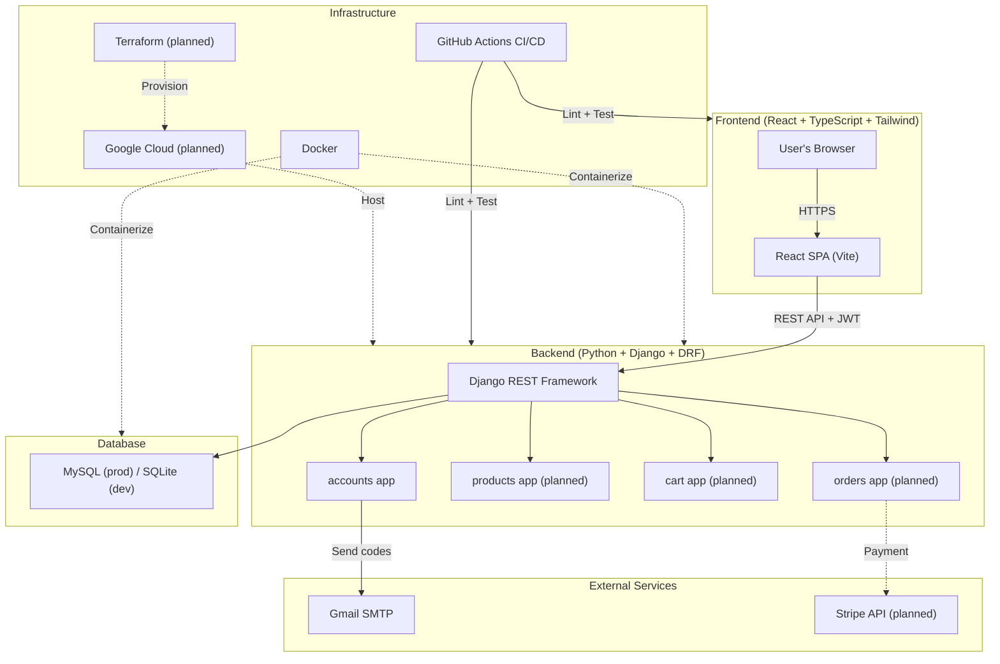
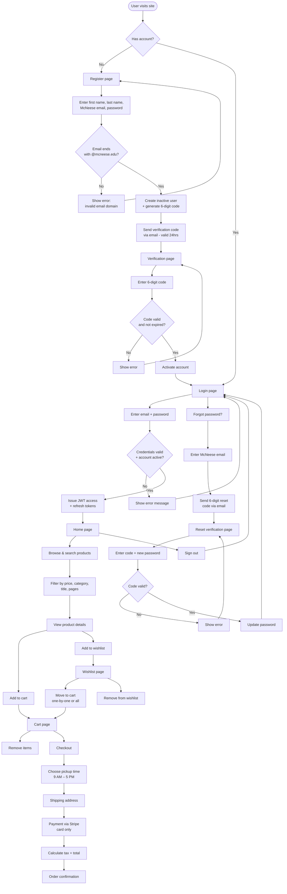
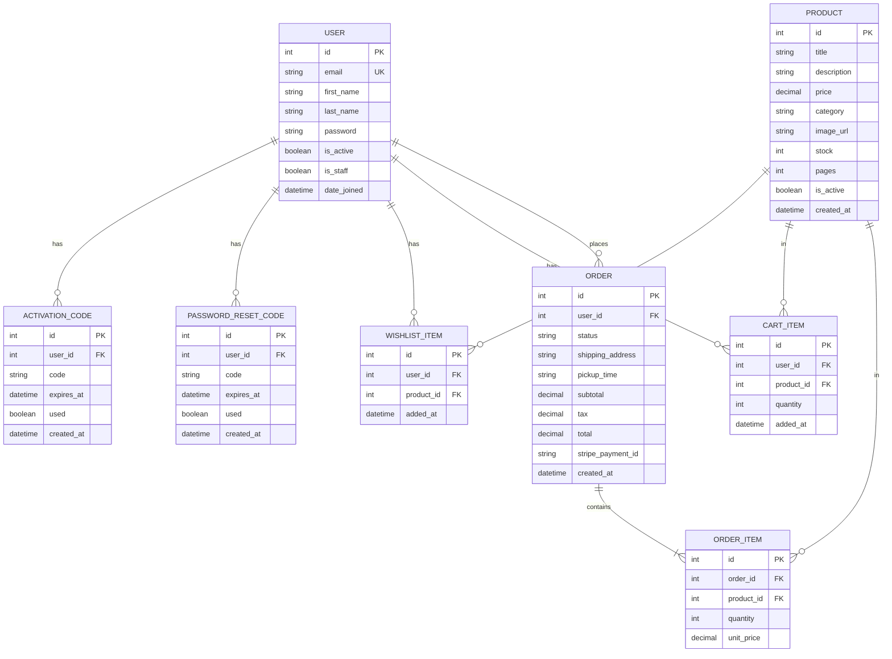
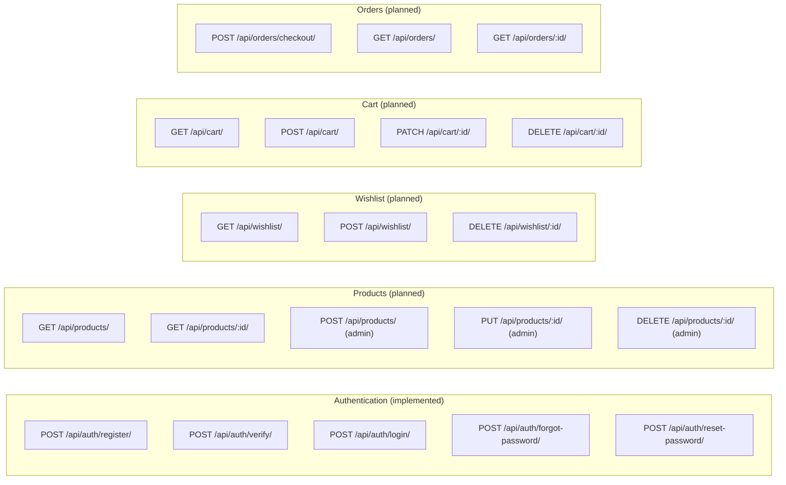
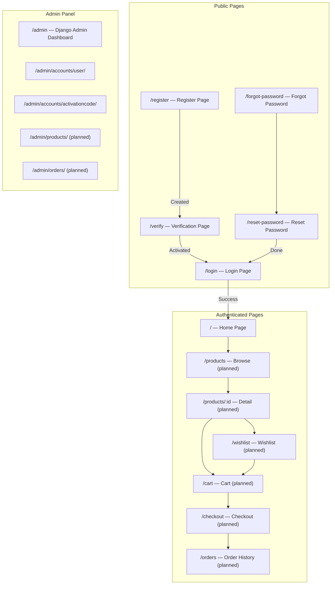
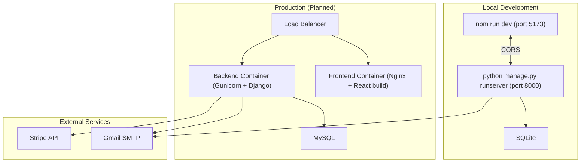

# Cowboy Online Bookstore — System Design

**Team:** Chiamaka Onwude, Wilfred Robert-Fajimi, Pacifique Sandrin Muramutsa, Fidel Anyanwu

---

## 1. High-Level System Architecture

---

## 2. User Flow — Full System

---

## 3. Data Model — Entity Relationship Diagram

> Full SQL DDL with indexes and constraints: [`docs/schema.sql`](docs/schema.sql)

---

## 4. API Endpoints

---

## 5. Frontend Page Map

---

## 6. Infrastructure Overview

---

## 7. Technology Stack Summary

| Component | Technology | Status |
| ---------------- | --------------------------- | ------------ |
| Backend | Python 3.11, Django 4.2 | Implemented |
| REST API | Django REST Framework | Implemented |
| Auth tokens | PyJWT (HS256) | Implemented |
| Frontend | React 18, TypeScript, Vite | Implemented |
| Styling | Tailwind CSS | Implemented |
| Database (dev) | SQLite | Implemented |
| Database (prod) | MySQL | Planned |
| Email | Gmail SMTP (HTML emails) | Implemented |
| Admin panel | Django Admin + Unfold theme | Implemented |
| CI/CD | GitHub Actions | Implemented |
| Payments | Stripe API | Planned |
| Containerization | Docker | Planned |
| Hosting | Google Cloud | Planned |
| IaC | Terraform | Planned |
